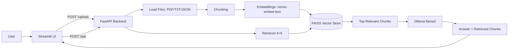

# Local RAG System (LangChain + Ollama)

Production-ready local RAG stack:

- Backend: FastAPI
- UI: Streamlit
- LLM/Embeddings: Ollama (`llama3`, `nomic-embed-text`)
- Vector DB: FAISS (local persisted index)

**Default API port is `8010`**, not `8000`. If you open `http://localhost:8000/docs` and see an HTML **404 Not Found** page (often Laravel/PHP), that port is a different app — use `http://localhost:8010/docs` for this RAG API.

## Project Layout

```text
rag-project/
├── backend/
│   ├── main.py
│   ├── rag.py
│   ├── ocr.py
│   ├── tools.py
│   └── config.py
├── ui/
│   └── app.py
├── data/
│   └── uploads/
├── vectorstore/
├── requirements.txt
├── Dockerfile
└── docker-compose.yml
```

## Quick Start (venv, recommended)

```bash
python3 -m venv .venv
source .venv/bin/activate
pip install -r requirements.txt
```

1. Ensure Ollama is running:

```bash
ollama serve
```

2. Ensure models exist:

```bash
ollama pull llama3
ollama pull nomic-embed-text
```

3. **OCR (image uploads):** install the Tesseract binary locally (required by `pytesseract`; no cloud APIs):

```bash
# macOS
brew install tesseract

# Ubuntu/Debian
sudo apt-get install -y tesseract-ocr
```

Check `GET /health` → `ocr_tesseract` should be `"ok"`.

4. Start backend:

```bash
source .venv/bin/activate
uvicorn backend.main:app --host 0.0.0.0 --port 8010
```

5. Start UI (new terminal):

```bash
source .venv/bin/activate
export API_BASE_URL=http://127.0.0.1:8010
STREAMLIT_BROWSER_GATHER_USAGE_STATS=false STREAMLIT_SERVER_HEADLESS=true streamlit run ui/app.py --server.port 8501 --server.address 0.0.0.0
```

6. Open:
- API docs: `http://localhost:8010/docs`
- UI: `http://localhost:8501`

## Optional Docker

```bash
docker compose up --build
```

- UI: `http://localhost:8501`
- API: `http://localhost:8010`
- Ollama: `http://localhost:11434`

After first start, pull models inside the Ollama service if needed:

```bash
docker compose exec ollama ollama pull llama3
docker compose exec ollama ollama pull nomic-embed-text
```

## What Has Been Done

- Environment audit completed (OS/Python/Docker/Ollama/models).
- Production-style RAG backend implemented with FastAPI.
- Streamlit UI implemented (API-only integration).
- FAISS persistence enabled in `vectorstore/faiss_index`.
- Upload support for `PDF`, `TXT`, `JSON`, and **images** (`PNG`/`JPG`/`JPEG`) via **local OCR** (Tesseract).
- End-to-end tests run for `/health`, `/upload`, `/ask`.
- One-command launcher added: `run_all.sh`.
- Optional Docker deployment included (`Dockerfile`, `docker-compose.yml`).

## API Endpoints

- `GET /health`
  - Returns backend status, Ollama URL, configured models, available models.
- `POST /upload`
  - Accepts `multipart/form-data` with one or more files (`pdf`, `txt`, `json`).
  - Saves files in `data/uploads/`, chunks + embeds + indexes into FAISS.
- `POST /ask`
  - Accepts JSON body:
    - `{"question": "your question"}`
  - Returns:
    - `answer`
    - `retrieved_chunks`
    - `k`

## One-command startup (bash)

From `rag-project`:

```bash
./run_all.sh          # start everything (default)
./start.sh            # same as ./run_all.sh
./run_all.sh stop     # stop API + UI only (Ollama keeps running)
./run_all.sh restart  # stop then start
./run_all.sh status   # health + ports
```

Optional: `BACKEND_PORT=8020 ./run_all.sh start` if `8010` is busy.

## System Workflow



## CV RAG accuracy (ingestion + retrieval)

- Each uploaded file gets an extra **high-priority chunk**: the first **500** characters of the full extracted text (see `DOCUMENT_HEADER_CHAR_LIMIT` in `backend/config.py`). This keeps the name and header block easy to retrieve.
- Retriever uses **`k=5`** chunks per question.
- **Name-style questions** are rewritten for retrieval to: `What is the full name of the person in this CV?` (original wording is still sent to the LLM in the prompt).
- Backend logs each retrieved chunk at **INFO** (`[debug] chunk=...`) for troubleshooting.

## Image uploads (ID cards, scans)

- Supported: `png`, `jpg`, `jpeg`.
- Text is extracted with **Tesseract** locally, cleaned, then chunked and embedded like other documents.
- Backend logs include **raw** and **cleaned** OCR previews (`backend.ocr` logger).
- For ID-like text, the model is instructed to add **Name / ID number / Expiry** when those fields appear in context.

## CV Upload and Q&A

Yes, you can upload your CV and ask questions like:

- "Tell me my name"
- "Summarize my experience"
- "What are my top skills?"

Notes:
- Text-based PDFs work best.
- Scanned/image PDFs may require OCR before upload.
- Retrieved chunks are shown in UI for transparency.

## Troubleshooting

- **HTML "404 Not Found" instead of FastAPI**
  - You are on the wrong port (often `:8000` is Laravel/another stack). Use **`http://127.0.0.1:8010/docs`** and set `API_BASE_URL=http://127.0.0.1:8010` for Streamlit.
- **Backend not reachable**
  - Start backend:
    - `uvicorn backend.main:app --host 0.0.0.0 --port 8010`
- **UI not reachable**
  - Start UI:
    - `streamlit run ui/app.py --server.port 8501 --server.address 0.0.0.0`
- **Ollama unavailable**
  - Start service:
    - `ollama serve`
- **Missing models**
  - Pull models:
    - `ollama pull llama3`
    - `ollama pull nomic-embed-text`
- **Image upload fails or empty OCR**
  - Install Tesseract (`brew install tesseract` on macOS). Confirm `/health` shows `"ocr_tesseract": "ok"`.
- **Logs**
  - `/tmp/rag_ollama.log`
  - `/tmp/rag_backend.log`
  - `/tmp/rag_ui.log`
